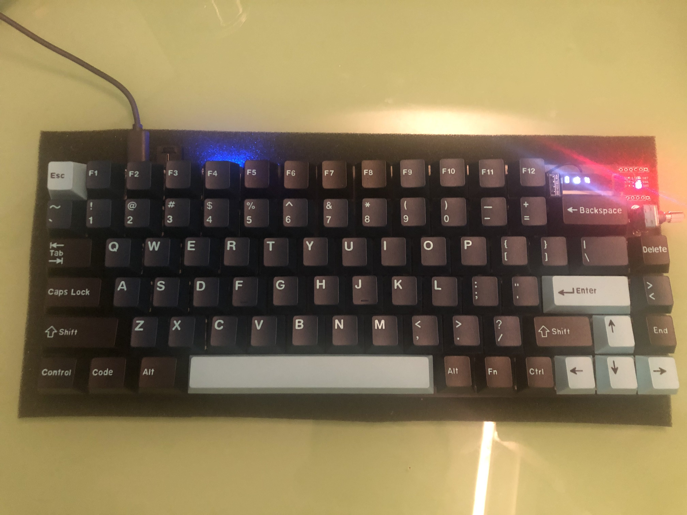

# STM32 Keyboard
[](https://youtu.be/Xp9VSN2TY44)

Originated from HKUST Elec3300 project

## Feature List
* 6*14 key matrix
* Programmable 6*14 RGB matrix
* On-board OLED display(SSD1306)
* Volume control by Rotary encoder
* Fingerprint sensor
* Programmable Macro
* Sleep Mode(low power mode)
* Connection:
    * Bluetooth
    * USB
* Power:
    * USB power supply
    * Battery(with USB charging)

## Feature Specification

### RTOS
We use RTOS to manage all the tasks

1. RGB Thread: 
    1. Change pwm pulse width to control color
2. Key Thread: 
    1. Detect key pressed and send HID report to computer
    2. Read volume encoder
3. Others Thread: 
    1. System Debug LED Blink
    2. Read Battery ADC
4. Key Interrupt
	1. Generate an interrupt whenever a key is pressed to keep the system awake.
5. Fingerprint Sensor Interrupt
    1. Since Comparing Fingerprint is quite a time-consuming process, it will delay the system so bad if using polling. Hence, we use a pin to detect interrupt whenever there is finger being detected by fingerprint sensor.

### Key Input

**Via Bluetooth**: 
* Use a **bluetooth HID** connection (RN42) to communicate with the computer to type characters
* Utilize the **button matrix** system as a way to indicate which character are being input to the computer

**Via Cable**:
* Use STM32 USB HID interface to communicate with the computer
* Use the same Button matrix system to indicate which character is being inputted

### Volume Control
* Use an encoder(timer) for detecting the volume changes and sent it to computer by HID.

### RGB Backlight
* To control the Brightness and Colour, **WS2812B** uses uptime and downtime indicate ‘0’ and ‘1’ data.
* Since changing **PWM** pulse width by delaying is not fast enough to handle the data transition (Sending ‘0’ byte then ‘1’), we refer to **DMA** to solve this issue as it is more performant.
* Different RGB pattern:
	- Static
	- Breath
	- Loop
	- Disable

### Sleep Mode
* Power-consuming parts will be disable when keyboard is idle for certain amount of time.
* Wake up by keys **interrupt**.

### OLED
* It uses **I2C** protocol in order to communicate with the **OLED** screen
* OLED serves as an User Interface for status and setup
* Pages:
	- Status(Connection mode, Battery)
	- RGB Mode(Static, Breath, Loop, Disable)
	- RGB static
	- Marco
	- FingerPrint

### Battery
* The battery is being read by an ADC, which uses a continuous mode.
* The value is read, and converted into percentage in our OLED

### Fingerprint Sensor
* It uses UART as a communication system to register, scan, and detect the fingerprint.
* Furthermore, having an interrupt when a finger is being detected help to reduce the need for pooling if a finger is placed on the scanner

## Environment
Download all of these before continuing:

- [arm-none-eabi-gcc](https://developer.arm.com/tools-and-software/open-source-software/developer-tools/gnu-toolchain/gnu-rm/downloads) for compiling (make sure you use the lastest version)
- [OpenOCD](https://github.com/xpack-dev-tools/openocd-xpack/releases/) for flashing and debugging
- [CMake](https://cmake.org/download/) for the build system
- [Ninja](https://ninja-build.org/) or some kind of Make
	- Ninja is faster and easier to install on windows
	- Mac/Linux can just use inbuilt Make easily

### Package Manager: Use Brew on Mac

https://brew.sh/

```
brew install --cask gcc-arm-embedded
brew install ninja
brew install cmake
brew install open-ocd
```

### Package Manager: Use Anaconda

https://anaconda.org/
While Anaconda is usually for handling Python packages you can find many. You may need this anyway

```
conda install -c conda-forge cmake ninja 
conda install -c litex-hub openocd # max/linux
conda install -c m-labs openocd # windows/linux
conda install -c dhgoldberg gcc-arm-none-eabi
```

### Package Manager: Use Chocolatey on Windows

https://chocolatey.org/

```
choco install gcc-arm-embedded
choco install openocd
choco install ninja
choco install cmake
```
## Building and Flashing:
In the command palette
- type `build` and find `CMake: Build`, remember the keyboard shortcut shown on the right for future use
- use `CMake: Build Target` and choose `flash`
- use `CMake: Set Build Target` to choose the default build target
    - this would make `CMake: Build` run that target
    - the default default build target is `all` which just compiles

## PCB
TODO

## Video Demo on Youtube
https://www.youtube.com/watch?v=Xp9VSN2TY44
